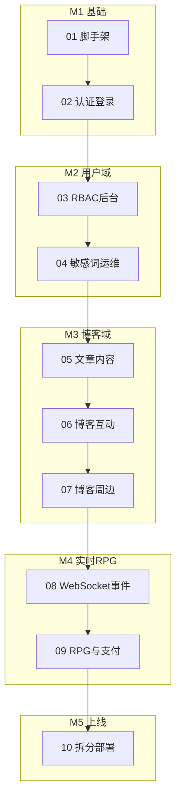

# Blog-Server-Go 十阶段实施计划索引

> 总方案：[blog-server-go-重构方案.md](../../blog-server-go-重构方案.md)（v3 · 4 服务学习版）
>
> 原则：**单体先行 → 验证模块边界 → 拆 4 服务 → 生产上线**

## 双层索引

- **5 里程碑（M1–M5）**：架构阶段分组，便于汇报进度
- **10 执行计划（01–10）**：Agent/人工逐步执行，每份 ~1–2 周、单一验收点

> 原 5 计划（`02-用户与认证域`、`03-博客内容域`、`04-实时通信与RPG支付`、`05-微服务拆分与生产上线`）已 supersede，由下方 10 计划替代。

## 里程碑与执行计划

| 里程碑 | 计划 | 文件 | 周期 | 架构 | 对应原方案周次 |
|--------|------|------|------|------|----------------|
| M1 基础 | 01 | [01-脚手架与公共基础.md](./01-脚手架与公共基础.md) | ~1-2 周 | 模块化单体 | 阶段0 + 第1周 |
| M1 基础 | 02 | [02-认证与用户登录.md](./02-认证与用户登录.md) | ~1-1.5 周 | 模块化单体 | 第2周 |
| M2 用户域 | 03 | [03-RBAC后台管理.md](./03-RBAC后台管理.md) | ~1-1.5 周 | 模块化单体 | 第8周 |
| M2 用户域 | 04 | [04-敏感词与运维骨架.md](./04-敏感词与运维骨架.md) | ~1 周 | 模块化单体 | 第9周 |
| M3 博客域 | 05 | [05-文章内容.md](./05-文章内容.md) | ~2 周 | 模块化单体 | 第3-4周 |
| M3 博客域 | 06 | [06-博客互动.md](./06-博客互动.md) | ~2 周 | 模块化单体 | 第5-6周 |
| M3 博客域 | 07 | [07-博客周边.md](./07-博客周边.md) | ~1-1.5 周 | 模块化单体 | 第7周 |
| M4 实时RPG | 08 | [08-WebSocket与事件驱动.md](./08-WebSocket与事件驱动.md) | ~1.5-2 周 | 模块化单体 | 第10周 |
| M4 实时RPG | 09 | [09-RPG与支付.md](./09-RPG与支付.md) | ~2-2.5 周 | 模块化单体 | 第11-12周 |
| M5 上线 | 10 | [10-微服务拆分与生产上线.md](./10-微服务拆分与生产上线.md) | ~2-3 周 | 4 微服务 | 阶段2+3 |

**总周期**：约 14–16 周（与原方案一致）

## 实施约定

- **Plan 01–09**：在模块化单体中开发，入口 `services/monolith/cmd/main.go`，模块按未来微服务域分包（`internal/user/`、`internal/blog/`、`internal/rpg/`）。
- **Plan 10**：将单体物理拆分为 `gateway` / `blog` / `user` / `rpg` 四个服务目录，REST 仅由 gateway 暴露。
- **数据库**：全程共享 MySQL 单库；各服务 Ent schema 只定义自己负责的表（见总方案 3.3）。
- **API 兼容**：对外保持 `/api/v1/*` 路径与 `{code, message, data}` 响应格式，前端无感切换。

## 不在 v3 范围内

- RAG 模块（`blog-server/src/modules/rag/`）— 后续扩展
- Kubernetes 部署 — 2G 机器用 docker-compose

## 使用方式

1. 按序号 01→10 执行，完成上一计划验收后再开始下一计划。
2. 每份计划末尾有 `- [ ]` 任务清单与「本计划不做」边界，完成后勾选。
3. 验收优先用可脚本化方式：`curl` smoke、Postman/newman、`make test` 子集。
4. 详细架构与代码示例见总方案对应章节，计划内仅摘录关键片段。
