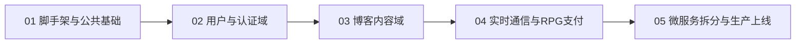

# Blog-Server-Go 五阶段实施计划索引

> 总方案：[blog-server-go-重构方案.md](../../blog-server-go-重构方案.md)（v3 · 4 服务学习版）
>
> 原则：**单体先行 → 验证模块边界 → 拆 4 服务 → 生产上线**

## 计划顺序与依赖

| 计划 | 文件 | 对应原路线图 | 周期 | 架构 |
|------|------|-------------|------|------|
| 01 | [01-脚手架与公共基础.md](./01-脚手架与公共基础.md) | 阶段0 + 阶段1第1周 | ~1-2 周 | 模块化单体 |
| 02 | [02-用户与认证域.md](./02-用户与认证域.md) | 阶段1第2、8、9周 | ~3-4 周 | 模块化单体 |
| 03 | [03-博客内容域.md](./03-博客内容域.md) | 阶段1第3-7、9周 | ~4-5 周 | 模块化单体 |
| 04 | [04-实时通信与RPG支付.md](./04-实时通信与RPG支付.md) | 阶段1第10-12周 | ~3 周 | 模块化单体 |
| 05 | [05-微服务拆分与生产上线.md](./05-微服务拆分与生产上线.md) | 阶段2 + 阶段3 | ~3-4 周 | 4 微服务 |

**总周期**：约 14-16 周（与原方案一致）

## 实施约定

- **Plan 01-04**：在模块化单体中开发，入口建议 `services/monolith/cmd/main.go`（Plan 01 创建），模块按未来微服务域分包（`internal/user/`、`internal/blog/`、`internal/rpg/`）。
- **Plan 05**：将单体物理拆分为 `gateway` / `blog` / `user` / `rpg` 四个服务目录，REST 仅由 gateway 暴露。
- **数据库**：全程共享 MySQL 单库；各服务 Ent schema 只定义自己负责的表（见总方案 3.3）。
- **API 兼容**：对外保持 `/api/v1/*` 路径与 `{code, message, data}` 响应格式，前端无感切换。

## 不在 v3 范围内

- RAG 模块（`blog-server/src/modules/rag/`）— 后续扩展
- Kubernetes 部署 — 2G 机器用 docker-compose

## 使用方式

1. 按序号执行，完成上一计划验收后再开始下一计划。
2. 每份计划末尾有 `- [ ]` 任务清单，完成后勾选。
3. 详细架构与代码示例见总方案对应章节，计划内仅摘录关键片段。
