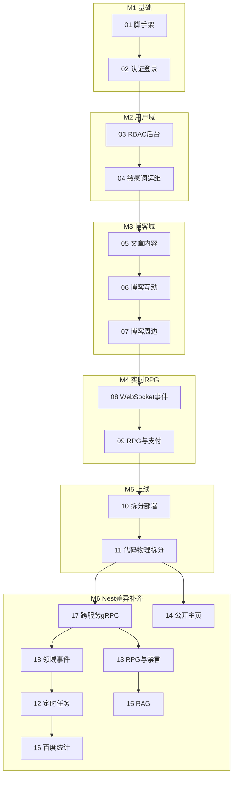

# Blog-Server-Go 实施计划索引

> 总方案：[blog-server-go-重构方案.md](../../blog-server-go-重构方案.md)（v3 · 4 服务学习版）
>
> 原则：**单体先行 → 验证模块边界 → 拆 4 服务 → 代码物理拆分 → 生产上线**

## 双层索引

- **5 里程碑（M1–M5）**：架构阶段分组，便于汇报进度
- **18 执行计划（01–18）**：Agent/人工逐步执行，每份 ~1–2 周、单一验收点

> 原 5 计划（`02-用户与认证域`、`03-博客内容域`、`04-实时通信与RPG支付`、`05-微服务拆分与生产上线`）已 supersede，由 01–11 替代。  
> **Plan 12–18** 为 v3 交付后与 Nest 差异补齐（M6），在 11 验收通过后按序执行。

## 里程碑与执行计划



| 里程碑 | 计划 | 文件 | 周期 | 架构 | 对应原方案周次 |
|--------|------|------|------|------|----------------|
| M1 基础 | 01 | [01-脚手架与公共基础.md](./01-脚手架与公共基础.md) | ~1-2 周 | 模块化单体 | 阶段0 + 第1周 |
| M1 基础 | 02 | [02-认证与用户登录.md](./02-认证与用户登录.md) | ~1-1.5 周 | 模块化单体 | 第2周 |
| M2 用户域 | 03 | [03-RBAC后台管理.md](./03-RBAC后台管理.md) | ~1-1.5 周 | 模块化单体 | 第8周 |
| M2 用户域 | 04 | [04-敏感词与运维骨架.md](./04-敏感词与运维骨架.md) | ~1 周 | 模块化单体 | 第9周 |
| M3 博客域 | 05 | [05-文章内容.md](./05-文章内容.md) | ~2 周 | 模块化单体 | 第3-4周 |
| M3 博客域 | 06 | [06-博客互动.md](./06-博客互动.md) | ~2 周 | 模块化单体 | 第5-6周 |
| M3 博客域 | 07 | [07-博客周边.md](./07-博客周边.md) | ~1-1.5 周 | 模块化单体 | 第7周 |
| M4 实时RPG | 08 | [08-WebSocket与事件驱动.md](./08-WebSocket与事件驱动.md) | ~1.5-2 周 | 模块化单体 | 第10周 |
| M4 实时RPG | 09 | [09-RPG与支付.md](./09-RPG与支付.md) | ~2-2.5 周 | 模块化单体 | 第11-12周 |
| M5 上线 | 10 | [10-微服务拆分与生产上线.md](./10-微服务拆分与生产上线.md) | ~2-3 周 | 4 微服务（运行时） | 阶段2+3 |
| M5 上线 | 11 | [11-微服务代码物理拆分.md](./11-微服务代码物理拆分.md) | ~3-4 周 | 4 微服务（代码隔离） | 阶段2 深化 |
| M6 Nest差异补齐 | 12 | [12-定时任务与运维后台.md](./12-定时任务与运维后台.md) | ~2-2.5 周 | 4 微服务 | — |
| M6 Nest差异补齐 | 13 | [13-RPG后台补全与社区禁言联动.md](./13-RPG后台补全与社区禁言联动.md) | ~2 周 | 4 微服务 | — |
| M6 Nest差异补齐 | 14 | [14-公开主页收藏与点赞列表.md](./14-公开主页收藏与点赞列表.md) | ~3-5 天 | 4 微服务 | 可与 13 并行 |
| M6 Nest差异补齐 | 15 | [15-RAG知识库模块.md](./15-RAG知识库模块.md) | ~3-4 周 | 4 微服务 | — |
| M6 Nest差异补齐 | 16 | [16-百度统计代理.md](./16-百度统计代理.md) | ~3-5 天 | 4 微服务 | 依赖 12 |
| M6 Nest差异补齐 | 17 | [17-微服务跨服务协作补齐.md](./17-微服务跨服务协作补齐.md) | ~1-1.5 周 | 4 微服务 gRPC | **11 后优先** |
| M6 Nest差异补齐 | 18 | [18-领域事件发布补齐.md](./18-领域事件发布补齐.md) | ~1-1.5 周 | blog 发布 + rpg 消费 | 依赖 17 |

**总周期**：约 17–20 周（Plan 01–11）+ 约 8–10 周（Plan 12–18，部分可并行）

### M6 推荐执行顺序

```
11 完成
 ├─► 17 跨服务 gRPC（敏感词/数据权限/dept/hit-records）  ← 微服务下必先做
 ├─► 18 领域事件发布（RPG 任务/扣 HP 链路）
 ├─► 12 定时任务（scheduled_publish 依赖 18 发事件）
 ├─► 13 RPG admin + BanGuard + 完整惩罚（依赖 17+18）
 ├─► 14 公开主页 collects/likes（可与 17 后并行）
 ├─► 16 百度统计（依赖 12）
 └─► 15 RAG（依赖 13，事件可接 18）
```

## 实施约定

- **Plan 01–09**：在模块化单体中开发，入口 `services/monolith/cmd/main.go`，模块按未来微服务域分包（`internal/user/`、`internal/blog/`、`internal/rpg/`）。
- **Plan 10**：四进程独立部署 + gateway 代理 + user gRPC + docker-compose（**运行时拆分**，代码仍在 monolith）。
- **Plan 11**：代码迁至 `services/{user,blog,rpg}/internal/`、Ent 分 schema、gateway gRPC BFF（**物理拆分**）。
- **数据库**：全程共享 MySQL 单库；各服务 Ent schema 只定义自己负责的表（见总方案 3.3）。
- **API 兼容**：对外保持 `/api/v1/*` 路径与 `{code, message, data}` 响应格式，前端无感切换。

## 不在 Plan 01–11 范围内（已由 Plan 12–18 承接）

- 微服务跨服务 gRPC（敏感词/数据权限/dept/hit-records）→ Plan 17
- 领域事件发布（blog → Redis Stream → rpg）→ Plan 18
- 定时任务 admin + 8 业务 cron → Plan 12
- Admin RPG stub / BanGuard / 敏感词审核联动 → Plan 13
- 公开主页 collects/likes → Plan 14
- RAG 模块 → Plan 15
- 百度统计 `/resources/baidutongji` → Plan 16

## 仍不在范围（或极小 patch，不单独成计划）

- 微信支付（JSAPI/小程序支付、商户回调）— 需企业商户号；充值主链路已走支付宝（Plan 09）
- Pub SSE（`/pub/ai-stream`）、gateway 全局限流 — 按产品决策暂不做
- Kubernetes 部署 — 2G 机器用 docker-compose
- 留言板 vvhan IP 归属、敏感词种子导入 — 可随 Plan 17/13 顺手补

## 使用方式

1. Plan 01→11 按序执行；**Plan 12→18** 在 11 验收通过后执行（**推荐先 17→18，再 12/13**，见上文 M6 顺序表）。
2. 每份计划末尾有 `- [ ]` 任务清单与「本计划不做」边界，完成后勾选。
3. **验收通过后须在 [`docs/`](../../docs/) 写入对应交付文档**（见各计划「文档交付」与 [`hertz-13-plan-docs.mdc`](../rules/hertz-13-plan-docs.mdc)），再进入下一计划。
4. 验收优先用可脚本化方式：`curl` smoke、Postman/newman、`make test` 子集。
5. 详细架构与代码示例见总方案对应章节，计划内仅摘录关键片段。

## 计划 ↔ 交付文档

| 计划 | 交付文档 |
|------|----------|
| 01–18 | [`docs/{同序号与标题}.md`](../../docs/README.md) |

索引与模板：[`docs/README.md`](../../docs/README.md)、[`docs/_template.md`](../../docs/_template.md)。
