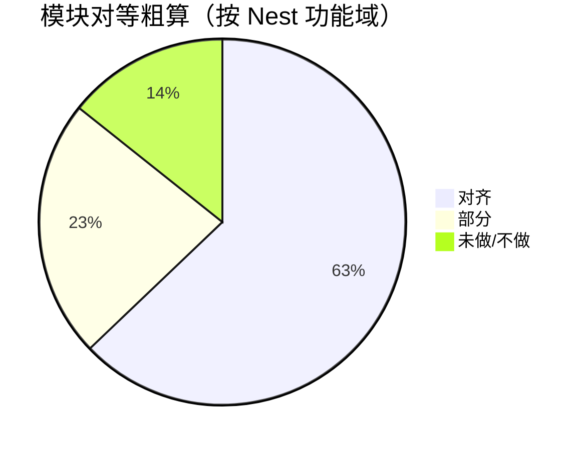

# NestJS ↔ Go 功能对等矩阵

> **用途**：回答「Go 有没有完整迁移 Nest？」——本表汇总 **Plan 01–18 交付结果 + 各 `docs/0N-*.md` 已知限制 + 计划「仍不在范围」**，作为单一查阅入口。  
> **更新日期**：2026-07-06  
> **Nest 对照仓库**：[`blog-server`](../../blog-server)（NestJS 11 单体）  
> **Go 仓库**：[`blog-server-go`](../)（gateway + user + blog + rpg 四微服务）

## 如何读这张表

| 状态 | 含义 |
|------|------|
| ✅ **对齐** | REST/行为与 Nest 一致，或差异已在交付文档标明且可接受 |
| ⚠️ **部分** | 路由存在但逻辑简化、stub 已替换但深度不足、或仅微服务/单体其一完整 |
| ❌ **未做** | Nest 有，Go 明确未实现 |
| 🚫 **不做** | 重构方案或计划刻意排除（非遗漏） |

**「Plan 已交付」≠「Nest 100% 等价」**：每份计划只验收本阶段任务；**待补齐**见 §5（Plan 19–21），**明确不做**见 §3.6。

**推荐验收层次**（由浅到深）：

1. **路由层**：[`api-routes.md`](./api-routes.md) — 对外 path 是否齐全  
2. **契约层**：`deploy/postman/*-smoke.json` — 冒烟是否 200  
3. **行为层**：本文模块表 + E2E（`test/e2e/`、`test/integration/`）  
4. **深度层**：RPG 惩罚链、文章等级、WS 事件等 §5 待补齐项（§3.6 为明确不做）  

---

## 1. 总览结论（2026-07-03）

| 维度 | 结论 |
|------|------|
| **能否替代 Nest 跑主站** | ✅ 可以：认证、文章、互动、RPG C 端、后台 RBAC、定时任务、RAG、gateway 代理 |
| **是否逐模块行为等价** | ⚠️ **M7 后 RPG 核心对齐**；工程化/支付/边缘项见 §3.6 **明确不做** |
| **API 路径兼容** | ✅ `/api/v1/*` + `{code,message,data}` 保持；见 [`api-routes.md`](./api-routes.md) |
| **架构** | Go 为 4 微服务 + 共享 MySQL；Nest 为单体 — 跨服务 gRPC/Stream 等价于 Nest 进程内调用 |



> 上图为粗算，明细见 §3；「部分」多集中在 RPG 深度与边缘能力。

---

## 2. Nest 模块 → Go 落点

| Nest 模块 | Go 服务/路径 | 状态 | 说明 / 交付文档 |
|-----------|--------------|------|-----------------|
| `security/auth` + `captcha` | user-service | ✅ | Plan 02；JWT/RSA/GitHub/邮箱/小程序登录 |
| `features/user` | user-service | ✅ | Plan 02–03 |
| `features/admin/system` RBAC | user-service | ✅ | Plan 03；角色/菜单/部门/数据权限 |
| `features/sensitive-word` | user-service + blog gRPC | ✅ | Plan 04、17、13；过滤 + hit 审核联动实体 status |
| `features/operation-log` | user-service | ✅ | Plan 04 |
| `features/article` | blog-service | ✅ | Plan 05；分类为扁平列表（与 Nest 一致） |
| `features/category` `tag` | blog-service | ✅ | Plan 05 |
| `comment` `reply` `like` `collect` | blog-service | ✅ | Plan 06、18；领域事件已发布 |
| `notification` | blog-service | ✅ | Plan 06、08；WS `siteNotification` |
| `msgboard` `link` `file` | blog-service | ✅ | Plan 07 |
| `features/email` | user/blog | ✅ | SMTP 验证码；定时汇总邮件 Plan 12 |
| `features/scheduled-task` | blog-service | ✅ | Plan 12；8 个内置 job + admin CRUD |
| `core/realtime` WS | blog-service `/realtime` | ✅ | Plan 08、**21**；P0 RPG WS 已对齐；连接上下文见 Plan 21 限制 |
| `core/events` Stream | blog 发布 + rpg/rag 消费 | ⚠️ | Plan 08、09、18、19、**20**；惩罚链已对齐 |
| `modules/rpg` C 端 | rpg-service | ✅ | Plan 09、**21**；核心玩法 + P0 WS 已对齐 |
| `rpg/admin` | rpg-service | ✅ | Plan 13；admin 写操作 stub 已替换 |
| `rpg/guards/ban.guard` | blog gRPC + rpg 本地 | ✅ | Plan 13；comment/reply/sign；msgboard 匿名同 Nest |
| `rpg/punishment` | rpg-service | ✅ | Plan 13 BanGuard + Plan **20** 全惩罚链 + 解封 WS |
| `rpg/level/article-level` | rpg-service | ✅ | Plan 19 `ArticleLevelService` + Stream 消费 |
| `modules/pay` | rpg-service | ⚠️ | 支付宝 ✅；微信支付 🚫 **明确不做** §3.6 |
| `modules/rag` | blog-service | ⚠️ | Plan 15；规则 Tool；LLM function calling 🚫 §3.6 |
| `features/resources` 百度统计 | blog-service | ✅ | Plan 16 |
| `features/pub` | gateway BFF | ⚠️ | `/pub/stats` ✅；`/pub/ai-stream` 🚫 |
| `gateway` 聚合 | gateway :8000 | ✅ | Plan 10–11；article/info、public profile BFF |

---

## 3. 能力矩阵（行为级）

### 3.1 用户与安全

| 能力 | Nest | Go | 状态 |
|------|------|-----|------|
| 登录/注册/刷新 token | ✅ | ✅ | ✅ |
| GitHub OAuth | ✅ | ✅ | ✅ |
| 微信小程序登录 | ✅ | ✅ | ✅ |
| RBAC 菜单/权限/数据权限 | ✅ | ✅ | ✅ |
| 图形验证码 | ✅ | ✅ | ✅ |
| 用户锁定 → 文章不可见 | ✅ | ✅ | ✅ Plan 17 `ListActiveUserIDs` |

### 3.2 博客内容

| 能力 | Nest | Go | 状态 |
|------|------|-----|------|
| 文章 CRUD / 搜索 / 归档 | ✅ | ✅ | ✅ |
| 定时发布 scheduled | ✅ | ✅ | ✅ Plan 12 cron + Plan 18 事件 |
| 阅读量统计 | ✅ | ✅ | ✅ |
| 文章统计大屏 trends | ✅ | ⚠️ | ⚠️ 部分指标简化（Plan 05/06 文档） |
| 领域事件 article 生命周期 | ✅ | ✅ | ✅ Plan 18 |
| RAG 索引增量（Stream） | ✅ | ⚠️ | ⚠️ 消费者就绪；静态页需手动 reindex |

### 3.3 社区互动

| 能力 | Nest | Go | 状态 |
|------|------|-----|------|
| 评论/回复/点赞/收藏 | ✅ | ✅ | ✅ |
| 敏感词分级 + pending | ✅ | ✅ | ✅ Plan 17 gRPC |
| 敏感词 hit 审核 → 实体 status | ✅ | ✅ | ✅ Plan 13 |
| 评论创建 → RPG 经验 | ✅ | ✅ | ✅ Plan 18 发布 + Plan 09 消费 |
| BanGuard 禁言拦截 | ✅ | ✅ | ✅ Plan 13 |
| 敏感词 HP 扣减 + 自动禁言 | ✅ | ✅ | ✅ Plan **20** |
| 站内通知 + WS | ✅ | ✅ | ✅ |

### 3.4 RPG

| 能力 | Nest | Go | 状态 |
|------|------|-----|------|
| 签到/任务/成就/抽奖/背包 | ✅ | ✅ | ✅ |
| 公会/赛季/排行榜 | ✅ | ✅ | ✅ |
| 充值（支付宝） | ✅ | ✅ | ✅ |
| 打赏 + WS | ✅ | ✅ | ✅ |
| Admin RPG CRUD | ✅ | ✅ | ✅ Plan 13 |
| Stream → 用户经验/任务 | ✅ | ✅ | ✅ |
| Stream → 文章等级 articleExp | ✅ | ✅ | ✅ Plan 19 |
| Punishment 护盾/累计禁言/归零禁言 | ✅ | ✅ | ✅ Plan **20** |
| WS `lifeChange` / `banStatus` | ✅ | ✅ | ✅ Plan 20 惩罚 + Plan **21** 社交 lifeChange |
| WS 成就/任务/文章/社交/背包 | ✅ | ✅ | ✅ Plan **21** P0 事件 |
| 公开主页 collects/likes 分页 | ✅ | ✅ | ✅ Plan 14 |
| 公开主页 articles 分页 | ✅ | ⚠️ | 🚫 简化列表，**明确不做** §3.6 |

### 3.5 运维与周边

| 能力 | Nest | Go | 状态 |
|------|------|-----|------|
| 定时任务 admin + 8 jobs | ✅ | ✅ | ✅ Plan 12 |
| 百度统计代理 | ✅ | ✅ | ✅ Plan 16 |
| RAG 问答 SSE | ✅ | ✅ | ⚠️ Tool 规则路由；LLM 二次路由 🚫 §3.6 |
| 文件上传/友链/留言板 | ✅ | ✅ | ✅ |
| operation_log | ✅ | ✅ | ✅ |

### 3.6 明确不做（🚫）

> 与 Nest 有差异，但**刻意不补齐**；不列入执行计划。完整清单见 [`.cursor/plans/README.md`](../.cursor/plans/README.md)「仍不在范围」。

| 能力 | Nest | Go | 备注 |
|------|------|-----|------|
| 微信支付 JSAPI/小程序支付 | ✅ | 🚫 | 支付宝为主；无商户号 |
| Postman 全量回归 `full-regression.json` | — | 🚫 | 现有 smoke + 单测/集成已够用 |
| Nest 并行 diff 脚本 | — | 🚫 | 不维护双栈自动化对比 |
| 公开主页 `articles` 分页 | ✅ | 🚫 | 简化列表；collects/likes 已对齐 Plan 14 |
| `article.published` blog 统计缓存消费者 | ✅ | 🚫 | 非 RPG 闭环必需 |
| RAG LLM function calling | ✅ | 🚫 | Plan 15 规则 Tool 已交付 |
| RAG Tool 接 rpg 榜/状态 gRPC | ✅ | 🚫 | 占位提示可接受 |
| WS `CheckOrigin` 生产白名单 | — | 🚫 | 运维随部署处理 |
| Stream XADD MAXLEN ~10000 | ✅ | 🚫 | 低优运维 |
| monolith 代码副本 | — | 🚫 | 保留对照 |
| `/pub/ai-stream` Pub SSE | ✅ | 🚫 | 产品决策暂不做 |
| Gateway 全局限流 | 部分 | 🚫 | 暂不做 |
| Kubernetes 部署 | — | 🚫 | 2G 用 docker-compose / PM2 |

---

## 4. 领域事件对等（`blog:events`）

| 事件 | Nest 发布 | Go 发布 | Nest 消费要点 | Go 消费 |
|------|-----------|---------|---------------|---------|
| `article.published` | ✅ | ✅ Plan 18 | 用户经验 + **文章初始 exp** | 用户经验 ✅；文章 exp ❌ |
| `article.updated/unpublished/deleted` | ✅ | ✅ | RAG 索引 | RAG ✅ |
| `comment/reply/msgboard/like/collect.created` | ✅ | ✅ | 用户经验 + **作者文章 exp** | 用户经验 ✅；文章 exp 部分 ❌ |
| `article.viewed` | ✅ | ✅ | 文章 exp + 浏览 dedup | dedup ✅；文章 exp ❌ |
| `sensitive-word.hit` | ✅ | ✅ | **PunishmentService 全链** | ✅ Plan **20** |
| `article.tipped` | ✅ | rpg 侧 | 声望/任务 | ✅ |
| `user.registered` | ✅ | — | RPG 初始化 | ✅（注册路径差异见 Plan 02） |

---

## 5. 待补齐（M7 · Plan 19–21）

> **仅列需执行的缺失项**；§3.6 与上表「明确不做」项**不得**再开计划。修复后改状态并注明日期。

| ID | 项 | Nest 参考 | Go 现状 | 优先级 | 状态 | 计划 |
|----|-----|-----------|---------|--------|------|------|
| P-01 | 敏感词惩罚全链 | `punishment.service.ts` `onSensitiveWordHit` | `PunishmentService` + consumer 委托 | **高** | ✅ 2026-07-06 | [20](../.cursor/plans/20-RPG惩罚链与禁言WS对齐.md) |
| P-02 | ArticleLevelService | `article-level.service.ts` + `rpg-event.consumer.ts` | Stream 消费写 exp/level/神作 | **高** | ✅ 2026-07-06 | [19](../.cursor/plans/19-RPG文章等级与Stream消费对齐.md) |
| P-03 | admin 解封 WS `banStatus` | `adminUnban` push | `AdminUnban` → `NotifyBanStatus` | 中 | ✅ 2026-07-06 | [20](../.cursor/plans/20-RPG惩罚链与禁言WS对齐.md) |
| P-04 | RPG WS 通知 + 成就/任务接线 | `rpg-notify.service.ts` | P0 事件 + 埋点已对齐 | **高** | ✅ 2026-07-06 | [21](../.cursor/plans/21-RPG实时通知与成就接线补齐.md) |

**执行顺序**：P-02（Plan **19**）→ P-01/P-03（Plan **20**）✅ → P-04（Plan **21**）。

M7 验收通过后，Go 与 Nest 在 **RPG 核心玩法**（文章等级、惩罚、实时通知）上视为对齐；其余差异以 §3.6 为准。

---

## 6. 快速自检命令

```powershell
# 路由是否注册（静态）
# 见 docs/api-routes.md

# 单元测试（PR 级）
cd d:\study\myGithub\blog-server-go
go test ./services/blog/internal/blog/service/... ./services/rpg/internal/rpg/admin/... -count=1

# 微服务冒烟（需 dev-all）
.\scripts\dev-all.ps1
$env:ADMIN_TOKEN = go run scripts/dev_login.go --token-only
newman run deploy/postman/rpg-admin-write-smoke.json --env-var baseUrl=http://127.0.0.1:8000 --env-var token=$env:ADMIN_TOKEN

# 领域事件 → RPG 经验（integration tag，需 dev-all）
go test -tags=integration ./test/integration/... -run TestIntegrationCommentPublishesRPGExp -count=1

# 搜残留 stub（应为 0）
rg 'notReady\(".*待完善' services/
```

---

## 7. 维护约定

1. **完成 Plan 19–21** 时：更新 §3、§5 对应行状态。  
2. **新增对外 API**：同步 [`api-routes.md`](./api-routes.md) + 本表。  
3. **每份 `docs/0N-*.md` 的「已知限制」** 若已解决：从交付文档删除或标「已解决」，并反映到本文 §5。  
4. **不要把本表复制进 `.cursor/plans/`**；计划写「要做什么」，本文写「整体对等真相」。

---

## 8. 相关文档

| 文档 | 说明 |
|------|------|
| [docs/README.md](./README.md) | Plan 01–21 交付索引 |
| [.cursor/plans/README.md](../.cursor/plans/README.md) | 计划边界与「仍不在范围」 |
| [api-routes.md](./api-routes.md) | HTTP/gRPC 路由全表 |
| [13-RPG后台补全与社区禁言联动.md](./13-RPG后台补全与社区禁言联动.md) | BanGuard / admin 写操作 |
| [18-领域事件发布补齐.md](./18-领域事件发布补齐.md) | 事件发布端 |
| [blog-server RPG-TECH.md](../../blog-server/src/modules/rpg/RPG-TECH.md) | Nest RPG 事件与惩罚设计 |
